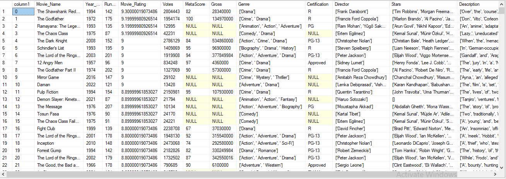
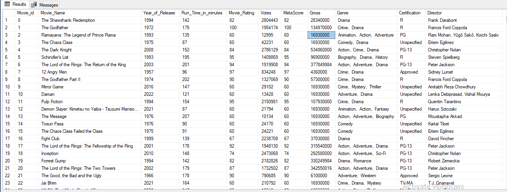

# Data-Cleaning-and-Enhancement-for-Movie-Database.
# Introduction:
In the dynamic realm of data analytics, my recent project titled "Data Cleaning for Analysis: Enhancing Movie Database" stands as a pivotal exploration into the transformative power of meticulous data refinement. Driven by a dual-purpose objective—to ready the dataset for insightful analysis and to delve deep into the intricacies of data cleaning using SQL—this endeavour became a pathway for personal upskilling. Through a systematic series of steps, including column pruning, null value resolution, and type standardisation, the project not only rendered the dataset analysis-ready but also served as a hands-on tutorial in refining real-world data. This documentation encapsulates the journey, challenges, and outcomes, underscoring the project's role in not only optimizing data quality but also fostering continuous learning in the ever-evolving landscape of data management and analytics.
# The Raw Dataset

# Tools
Microsoft SQL Server
 # Data Source:
The dataset utilized in this project originates as a CVS file from Kaggle, a renowned online platform for data science competitions and collaborative data analysis. Kaggle provides a diverse array of datasets contributed by a global community, making it a valuable resource for practitioners and enthusiasts alike. The dataset chosen for the "Data Cleaning for Analysis: Enhancing Movie Database" project on Kaggle serves as a rich and real-world collection of movie-related information. Leveraging Kaggle's platform, the project harnesses the power of community-driven data sharing, reinforcing the collaborative nature of data science and showcasing the project's adaptability to diverse datasets from reputable sources.
# Data Exploration
The data exploration phase of the project was a crucial inception point, revealing the intricacies of the dataset sourced from Kaggle. Through systematic examination and analysis, key insights into the structure, composition, and potential challenges of the dataset were unearthed. This initial exploration not only laid the foundation for subsequent cleaning steps but also informed strategic decisions on handling null values, dropping unnecessary columns, and standardizing data types. 
# Dropping Columns
Alters the table structure by removing the Stars and Description columns to clean up unnecessary data. This operation eliminates columns that may not be relevant or needed for analysis, improving database efficiency.
# Null Value Handling
**NULL** values in the Votes,  Gross, MetaScore and Movie Rating columns were updated with the Median value of each column. This helped to complete incomplete or missing information, allowing for further investigation or data correction.
Similarly, the NULL values in the Certification column were updated with the value 'Unspecified' for completeness, and clarity and to enhance the comprehensibility of the data.
# Data Type Conversion
columns. Converts the data type of the Movie_Rating, Votes, MetaScore, and Gross, columns from NVARCHAR to INT for consistency and compatibility. This ensures that these columns contain integer values, making it easier to perform numerical operations or comparisons.
# Duplicate Row Detection
 Finds duplicate rows based on multiple columns, helping to maintain data integrity and remove redundant entries. The query compares each record with others in the table, identifying instances where all specified columns have the same values, indicating potential duplicates.
# Column Renaming
Renaming a Column (Using sp_rename) Renames column 1 to Movie_id using the sp_rename stored procedure for improved clarity and consistency. This provides a more descriptive and standardised name for the Movie_id column, aligning with best practices for database design.
# Cleaning Director and Genre Columns
 Removes brackets and single quotes from the Director and Genre columns, enhancing data cleanliness and readability. This operation standardizes the format of the Director and Genre columns, making the data more consistent and user-friendly.
Outcome:

# Code Samples:
The SQL queries/codes

# Conclusion:
In conclusion, this SQL data cleaning project has successfully transformed a Kaggle-sourced movie dataset into a refined and analysis-ready resource. Through systematic steps such as column pruning, null value handling, and data type standardization, the project not only optimized data quality but also served as a valuable learning experience. This endeavour underscores the significance of meticulous data preparation in facilitating insightful analyses and highlights the continuous learning journey within the dynamic realm of data management and analytics.
# References:
[Lint text](https://www.youtube.com/watch?v=8rO7ztF4NtU&pp=ygUeRGF0YXNldCBjbGVhbmluZyB3aXRoIHNxbCBBbGV4)

